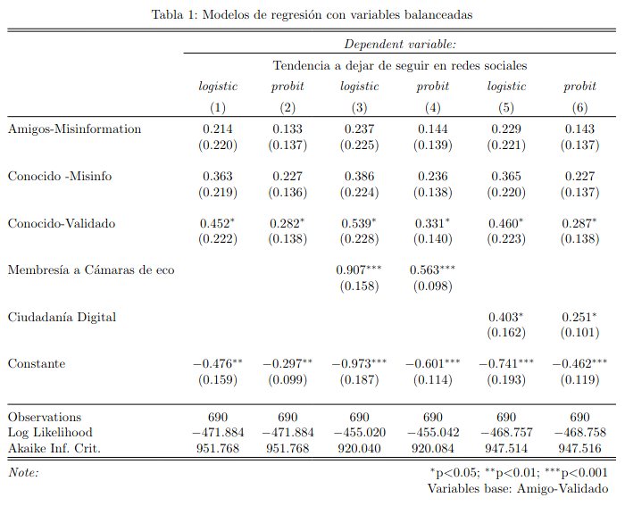
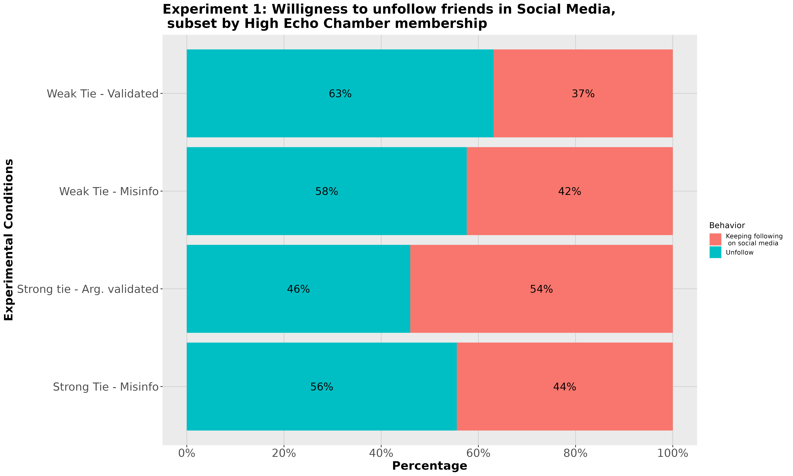

  class: left, Top

## Escala de membrería a cámaras de eco

- Se usa una escala recientemente validadae<sup>*</sup> sobre reinforcement opinion en redes sociales

- 7 ítemes con un rango de 1 a 10 por cada ítem (tota: 7 a 70)

- Baja membresía a cámaras de eco: 7 to 39
- Alta membresía a cámaras de eco: 40 to 70

.footnote[[*] Kaakinen, M., Sirola, A., Savolainen, I., & Oksanen, A. (2020). Shared identity and shared
          information in social media: Development and validation of the identity bubble
          reinforcement scale. Media Psychology, 23(1).]

---
  class: left, Top

## Escala de ciudadanía digital

- Se usa una escala desarrollada por Choi<sup>*</sup> y reducida de 34 a 14 ítemes.

- Cada ítem está en una escala de 7 puntos (1 a 7). total: 14 to 98

- Bajos niveles de ciudadanía digital: 14 to 62
- Altos niveles de ciudadanía digital: 63 to 98

.footnote[[*] Choi, M., Glassman, M., & Cristol, D. (2017). What it means to be a citizen in the internet age:
            Development of a reliable and valid digital citizenship scale. Computers & Education, 107,
          100-112.]

---
  class: top, center



---
  
  

---
  class: middle, center


```{r, echo=FALSE, fig.align='center'}
knitr::include_graphics("mepop_presentation_files/PlotE1General.png")
```


---
  
  ```{r, echo=FALSE, fig.align='center'}
knitr::include_graphics("mepop_presentation_files/PlotE1DigitHigh.png")
```

---
  
  
  ```{r, echo=FALSE, fig.align='center'}

```