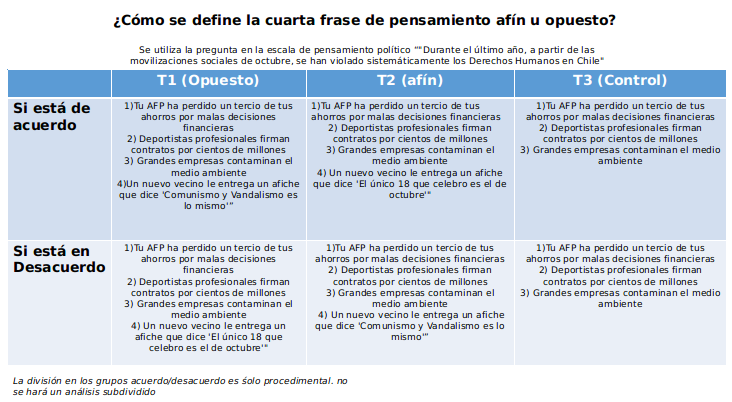
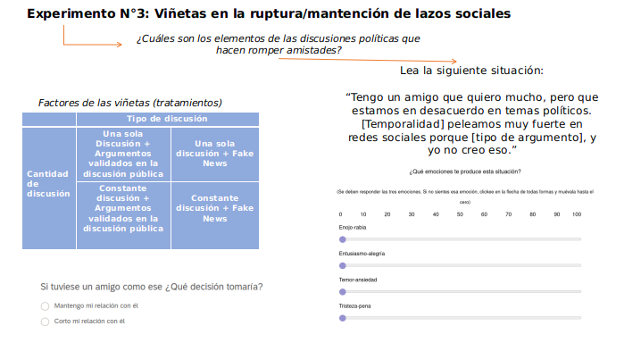
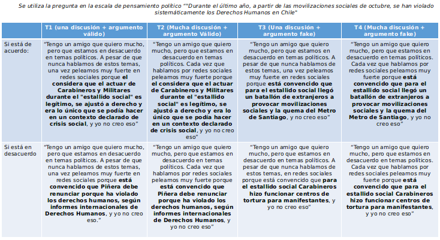

class:center, middle, bg_karl

```{r setup, include=FALSE}
options(htmltools.dir.version = FALSE)
```
```{r xaringan-themer, include=FALSE, warning=FALSE, echo=FALSE, message=FALSE}
library(xaringanthemer)
style_mono_accent(
  base_color = "#23395b",
  header_font_google = google_font("Josefin Sans"),
  text_font_google   = google_font("Montserrat", "300", "300i"),
  code_font_google   = google_font("Fira Mono")
)
style_mono_light(base_color = "#23395b")
```
```{r, warning=FALSE, message=FALSE, echo=FALSE}
remotes::install_github('rstudio/chromote')
pacman::p_load(cowplot, ggplot2, tidyverse, dplyr, patchwork, kableExtra, MASS, ggpubr, fastDummies, renderthis)
```
```{css, echo = F}
.bg_karl {
  position: relative;
  z-index: 1;
}
.bg_karl::before {    
      content: "";
      background-image: url('https://ctrinstitute.com/wp-content/uploads/2022/03/two-people-butting-heads-politics-1200x500-c-default.jpg');
      background-size: 1200px;
      position: absolute;
      top: 0px;
      right: 0px;
      bottom: 0px;
      left: 0px;
      opacity: 0.2;
      z-index: -1;
}
```

### Cuando hablamos con el adversario. Una encuesta experimental sobre emociones y tolerancia política en Chile

<br>
<br>

#### Francisco Villarroel (CICS-UDD) | Jaquelin Morillo (CICS-UDD/MEPOP) 
#### Raúl Elgueta Rosas (IDEA-USACH)

<br>

```{r, echo=FALSE, out.width="60%", fig.align='center'}
knitr::include_graphics("mepop_presentation_files/logo_mepop.png")
```


<font size="-1">Proyecto ANID N.º 171426: “La estructura de la sociabilidad en Chile y sus consecuencias para nuestra convivencia. Análisis longitudinal de redes sociales”, a Cargo del profesor Vicente Espinoza (COES)</font>

---
class: left, botton


Habitualmente acá van unas fotos de provocación para poner el tema. quizás etsas mismas sirvan


---
background-image: url(beamer_presentation_files/logo-dark-small.png)
background-size: 40px
background-position: 95% 8%
class: center, middle

## Problema de investigación

--
### ¿Existe una relación entre las emociones y las interacciones políticas?
#### ¿Cómo la pertenencia a cámaras de eco y la ciudadanía digital profundizan o modulan dichos efectos entre las emociones y las actitudes políticas? 

---
background-image: url(beamer_presentation_files/logo-dark-small.png)
background-size: 40px
background-position: 95% 8%
class: left, middle

.pull-left[

## Cámaras de Eco y Ciudadanía digital 
]

.pull-right[

<div style="text-align: justify">
- Cámaras de Eco: Redes de amistad y recursos hechas entre personas de pensamiento político similar. Incluye homofilia política, identidad social y sesgos de confirmación (Boutyline et.al, 2017; Wollebæk et. al, 2019). 

- A menudo producida por algoritmos (Pariser, 2011).


- Tipos de participación política en plataformas digitales: Incluyen habilidades tecnológicas, valoración de la acción colectiva en medios digitales y participación en ella. (Choi, M, 2016; Choi et.al, 2018; Chadwick, 2013; Castells, 2009). 
<div/>
]

---
background-image: url(beamer_presentation_files/logo-dark-small.png)
background-size: 40px
background-position: 95% 8%
class: left, middle

.pull-left[

## Emociones y Teoría del Razonamiento Motivado

]
<div style="text-align: justify">
.pull-right[

- Teoría del Razonamiento Motivado: Modelo dual que distingue entre dos estrastegias de  procesamiento de la información: la automatizada y la controlada.

- Ambas estrategias interactúan en la producción del pensamiento y la conducta.

- los sentimientos positivos y/o negativos son parte integral del procesamiento de la información proporcionando motivación y dirección al pensamiento (Taber y Lodge, 2016: 63-64).
<div/>

]

---
background-image: url(beamer_presentation_files/logo-dark-small.png)
background-size: 40px
background-position: 95% 8%
class: left, middle


.pull-left[

## Relación con intolerancia política y emociones


- En el contexto político, la ira afecta negativamente al tiempo dedicado a la adquisición de información, limita las fuentes consultadas, lo que conduce a opiniones menos reflexivas, e inhibe el recuerdo preciso de la información recopilada. 
]


.pull-right[

<div style="text-align: justify">
- La ira también se relaciona con acciones arriesgadas y de confrontación que se asocian directamente con la intolerancia y la reticencia a deliberar en el mundo (Brader & Marcus, 2013:179).

- La felicidad en la esfera política está asociada al éxito partidista, a las personas afines y a las políticas deseables. También aumenta el interés por los procesos políticos, motiva la acción y refuerza la confianza en las convicciones previas para tomar decisiones políticas. Finalmente, funciona como un acelerador de la movilización en el contexto político (Brader y Marcus, 2013:176).
<div/>
]

---
background-image: url(beamer_presentation_files/logo-dark-small.png)
background-size: 40px
background-position: 95% 8%
class: left, top


## Hipótesis ## PANCHO!!!


#### hola
--

##### acá va otra

--

##### y otra


---
background-image: url(beamer_presentation_files/logo-dark-small.png)
background-size: 40px
background-position: 95% 8%
class:left, middle

### Methods


--
**Sample**

<div style="text-align: justify">

Encuesta experimental en línea (n= 690) hecha en el Pool del Centre for Experimental Social Sciences (CESS-USACH)
<div/>
--
<div style="text-align: justify">
**Randomization**

Block randomization with Eco Chamber membership and levels of digital citizenship (both binaries)

<div/>
--
<div style="text-align: justify">
**Experimental survey**

Caracterización sociodemográfica: Rango etario, géner, ingreso, nivel educativo, Ideología política + 2 Estudios experimentales
<div/>
--
<div style="text-align: justify">
**Validación**

Comité de expertos, entrevistas cognitivas, pilotaje

<div/>
--
<div style="text-align: justify">
**Analysis**

ATE, *Kruskall-Walis* and *Wilcoxon test*. Probit y Logit regressions

<div/>
---
background-image: url(beamer_presentation_files/logo-dark-small.png)
background-size: 40px
background-position: 95% 8%
class:left, top

.pull-left[

### Estudio 1

]

.pull-right[

<div style="text-align: justify">

  - Experimento de Lista para observar comportamientos socialmente sensibles.

  - Se medirá el nivel de enojo que provoca la cercanía social (presencial) de una persona de distinto pensamiento político.

  - Tres condiciones experimentales: Control, pensamiento afin y pensamiento opuesto

  - Personas responden nivel de enojo en una escala de 1 a 7 (ordinal).

  - Se Aplicará un ATE, test de Kruskall Wallis y Wilcoxon para diferencia entre medias.
  
  - Ordered logit para variables balanceadas y no balanceadas.

<div/>

]

---
class: center, middle
background-image: url(beamer_presentation_files/treatments_table.png)
background-size: contain


```{r, echo=FALSE, fig.align='center'}



```
---
background-image: url(beamer_presentation_files/Plot1.png)
background-size: contain
background-position: 50% 50%
class: center, middle

## Resultados Estudio 1


---
background-image: url(beamer_presentation_files/Plot1.png)
background-size: contain
background-position: 50% 50%
class: center, middle

## Tabla de regresiones Estudio 1


---
background-image: url(beamer_presentation_files/logo-dark-small.png)
background-size: 40px
background-position: 95% 8%
class:left, top

.pull-left[

### Estudio 2

]

.pull-right[

<br>

<div style="text-align: justify">

  - El segundo es un experimento con viñetas en el que se evalúa la relación entre la emocionalidad y la fuerza de los vínculos sociales digitales. 

  - Se Aplicará un ATE, test de Kruskall Wallis y Wilcoxon para diferencia entre medias.
  
  - Logit y probit Binomial para variables balanceadas y no balanceadas.
  
  - Los resultados mostraron que quienes presentan una mayor intensidad emocional tienden a romper sus lazos sociales digitales con mayor facilidad.
  


<div/>

]

---
class: center, middle
background-image: url(beamer_presentation_files/treatments_table.png)
background-size: contain


```{r, echo=FALSE, fig.align='center'}



```
---
class: center, middle
background-image: url(beamer_presentation_files/treatments_table.png)
background-size: contain


```{r, echo=FALSE, fig.align='center'}



```

---
background-image: url(beamer_presentation_files/Plot1.png)
background-size: contain
background-position: 50% 50%
class: center, middle

## Resultados Estudio 2


---
background-image: url(beamer_presentation_files/Plot1.png)
background-size: contain
background-position: 50% 50%
class: center, middle

## Tabla de regresión estudio 2

---
background-image: url(beamer_presentation_files/logo-dark-small.png)
background-size: 40px
background-position: 95% 8%
class:left, top

## Discusión


---
background-image: url(beamer_presentation_files/logo-dark-small.png)
background-size: 40px
background-position: 95% 8%
class:left, middle

###Discusión 2


---
class: inversed, center, middle
background-image: url(https://user-images.githubusercontent.com/163582/45438104-ea200600-b67b-11e8-80fa-d9f2a99a03b0.png)
background-size: 50px
background-position: 50% 85%

# ¡Thank You!

####.pull-left[Francisco Villarroel (fvillarroelr@udd.cl)

]

####.pull-right[Jaquelin Morillo (jaquelin.morillo@gmail.com)

]

<br>
<br>
<br>
<br>
<br>
<br>
<br>
<br>
<br>
<br>
<br>
<br>
<br>
<br>
<br>
This slide has created with [**xaringan**](https://github.com/yihui/xaringan) and [**XaringanThemer**](https://pkg.garrickadenbuie.com/xaringanthemer/index.html)

---
class: inverted, center, middle

# Appendix

---
background-image: url(beamer_presentation_files/regression_balanced.png)
background-size: contain
background-position: 50% 50%
class: middle, center

---
background-image: url(beamer_presentation/beamer_presentation_files/logo-dark-small.png)
background-size: 40px
background-position: 95% 8%
class: left, Top

## Some Insights about non-balances regression

- There a critical pint in the age-range. Younger people scores better. people to 45years+ tend to decrease the scoring.

- People with more education scoring better.

- There's no evidence of variations in political ideology and educational levels

---
background-image: url(beamer_presentation_files/logo-dark-small.png)
background-size: 40px
background-position: 95% 8%
class: left, Top

## Eco Chamber membership Scale

- Using a recent validated scale<sup>*</sup> about reinforcement opinion in social media

- 7 items with 1 to 10 range por each item (total Range: 7 to 70)

- Low Eco Chamber Membership: 7 to 39
- High Ecochamber Membership: 40 to 70

.footnote[[*] Kaakinen, M., Sirola, A., Savolainen, I., & Oksanen, A. (2020). Shared identity and shared
information in social media: Development and validation of the identity bubble
reinforcement scale. Media Psychology, 23(1).]

---
background-image: url(beamer_presentation_files/logo-dark-small.png)
background-size: 40px
background-position: 95% 8%
class: left, Top

## Digital Citizenship scale

- Using a Scale development by Choi<sup>*</sup> and reduced since 34 items to 14.

- Each item are with a 7 point scale (1 to 7). Total range: 14 to 98

- Low levels of digital citizenship: 14 to 62
- High levels of Digital citizenship: 63 to 98

.footnote[[*] Choi, M., Glassman, M., & Cristol, D. (2017). What it means to be a citizen in the internet age:
Development of a reliable and valid digital citizenship scale. Computers & Education, 107,
100-112.]
---

**References:**

- Allen, J. N. L., Martel, C., & Rand, D. G. (2021). Birds of a feather don’t fact-check each other: Partisanship and the evaluation of news in Twitter’s Birdwatch crowdsourced fact-checking program [Preprint].

- Bago, B., Rand, D. G., & Pennycook, G. (2020). Fake news, fast and slow: Deliberation reduces belief in false (but not true) news headlines. Journal of Experimental Psychology: General, 149(8), 1608-1613. 

- Castells, M. (2009). Comunicación y poder. Alianza, Madrid.

- Choi, D., Chun, S., Oh, H., Han, J., & Kwon, T. “Taekyoung”. (2020). Rumor Propagation is Amplified by Echo Chambers in Social Media. Scientific Reports, 10(1), 310.

- Choi, M. (2016). A Concept Analysis of Digital Citizenship for Democratic Citizenship Education in the Internet Age. Theory & Research in Social Education, 44(4), 565-607.

- Choi, M., Cristol, D., & Gimbert, B. (2018). Teachers as digital citizens: The influence of individual backgrounds, internet use and psychological characteristics on teachers’ levels of digital citizenship. Computers & Education, 121, 143-161. 

--- 
class: left, top

- Currarini, S., & Mengel, F. (2016). Identity, homophily and in-group bias. European Economic Review, 90, 40-55. 

- Fu, G., & Zhang, W. (2016). Opinion formation and bi-polarization with biased assimilation and homophily. Physica A: Statistical Mechanics and Its Applications, 444, 700-712.

- Halberstam, Y., & Knight, B. (2016). Homophily, group size, and the diffusion of political information in social networks: Evidence from Twitter. Journal of Public Economics, 143, 73-88. 

- Osmundsen, M., Bor, A., Vahlstrup, P. B., Bechmann, A., & Petersen, M. B. (2021). Partisan Polarization Is the Primary Psychological Motivation behind Political Fake News Sharing on Twitter. American Political Science Review, 115(3), 999-1015. 

- Pennycook, G., & Rand, D. G. (2019). Lazy, not biased: Susceptibility to partisan fake news is better explained by lack of reasoning than by motivated reasoning. Cognition, 188, 39-50.

- Pereira, A., Harris, E., & Van Bavel, J. J. (2021). Identity concerns drive belief: The impact of partisan identity on the belief and dissemination of true and false news. Group Processes & Intergroup Relations.

---
class: left, top

- Taber, C. S., & Lodge, M. (2006). Motivated Skepticism in the Evaluation of Political Beliefs. American Journal of Political Science, 50(3), 755-769.

- Wollebæk, D., Karlsen, R., Steen-Johnsen, K., & Enjolras, B. (2019). Anger, Fear, and Echo
Chambers: The Emotional Basis for Online Behavior. Social Media + Society, 5(2).

---
background-image: url(beamer_presentation_files/headline_sets.png)
background-size: contain
background-position: 50% 50%
class: top, center

---
background-image: url(https://raw.githubusercontent.com/francisco-vr/Homophily-and-Political-behaviour/main/Results/Tables/sample-descriptives.jpg)
background-size: contain
background-position: 50% 50%
class: top, center