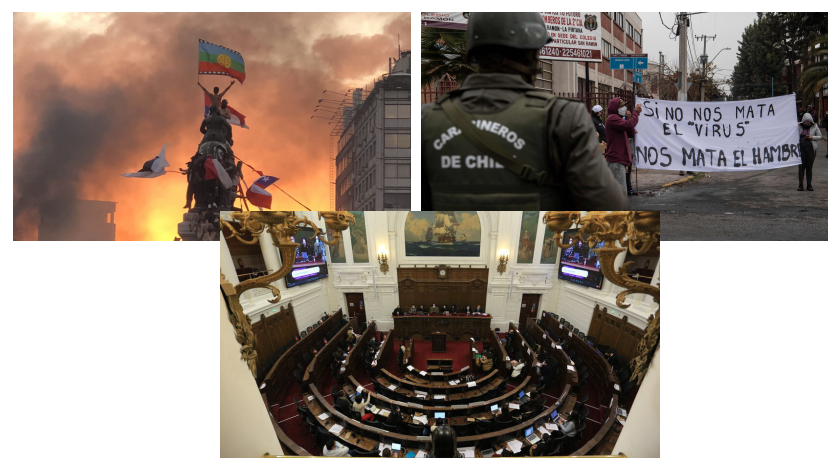
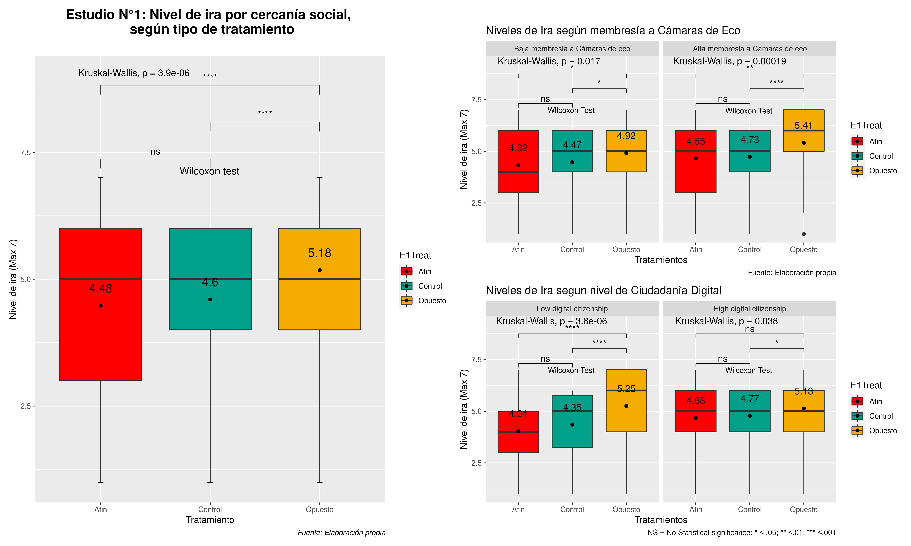
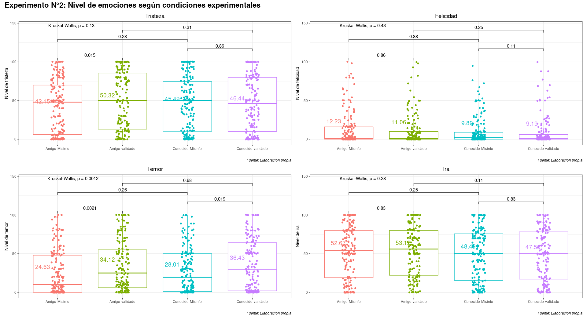
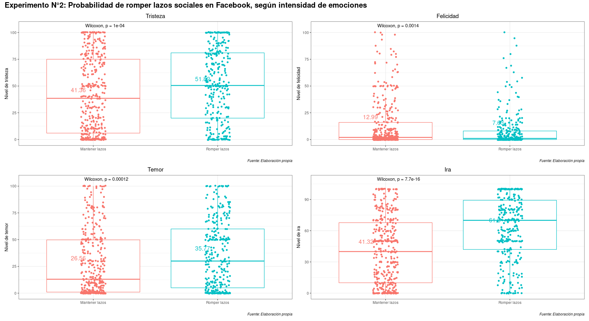
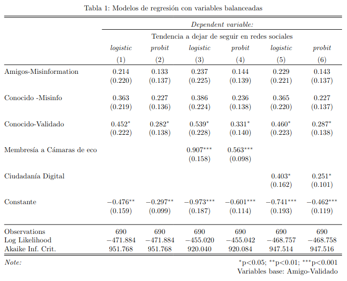
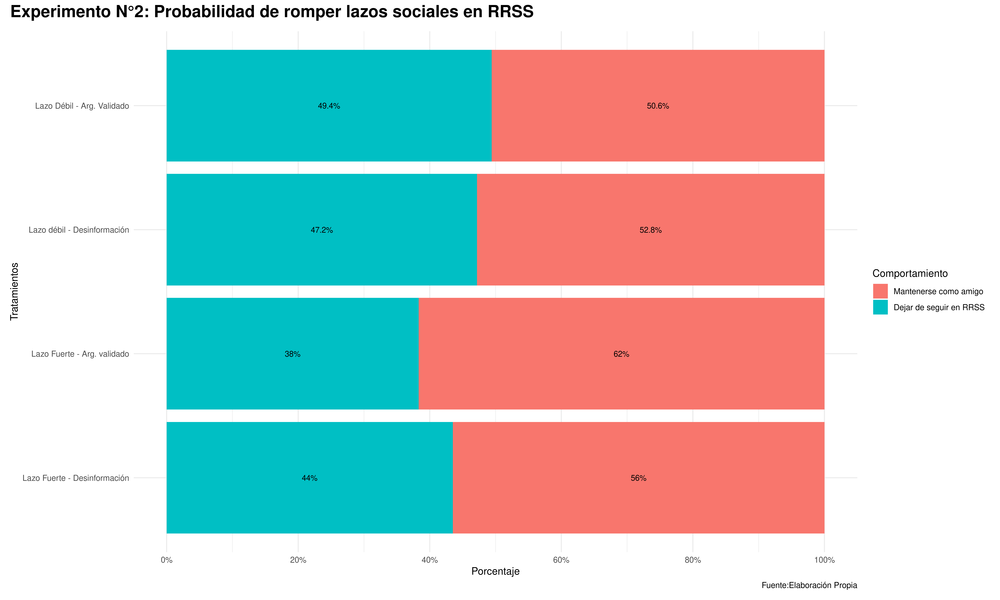
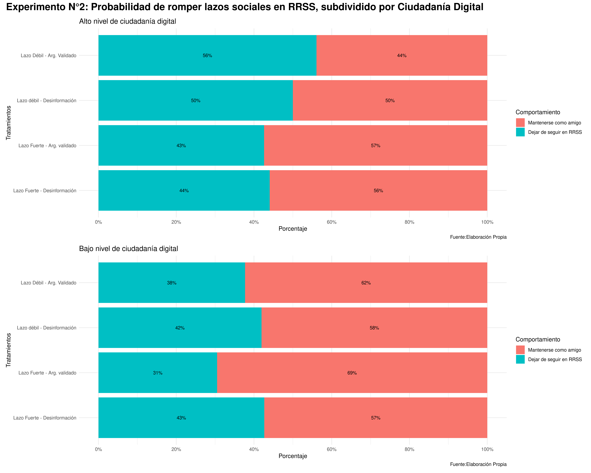
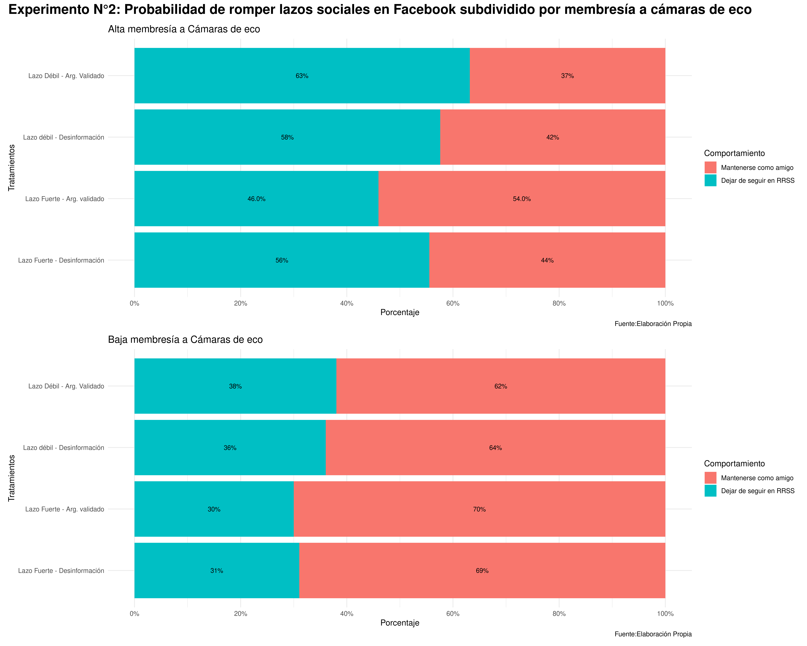

class:center, middle, bg_karl

```{r setup, include=FALSE}
options(htmltools.dir.version = FALSE)
```
```{r xaringan-themer, include=FALSE, warning=FALSE, echo=FALSE, message=FALSE}
library(xaringanthemer)
style_mono_accent(
  base_color = "#23395b",
  header_font_google = google_font("Josefin Sans"),
  text_font_google   = google_font("Montserrat", "300", "300i"),
  code_font_google   = google_font("Fira Mono")
)
style_mono_light(base_color = "#23395b")
```
```{r, warning=FALSE, message=FALSE, echo=FALSE}
remotes::install_github('rstudio/chromote')
pacman::p_load(cowplot, ggplot2, tidyverse, dplyr, patchwork, kableExtra, MASS, ggpubr, fastDummies, renderthis)
```
```{css, echo = F}
.bg_karl {
  position: relative;
  z-index: 1;
}
.bg_karl::before {    
      content: "";
      background-image: url('https://ctrinstitute.com/wp-content/uploads/2022/03/two-people-butting-heads-politics-1200x500-c-default.jpg');
      background-size: 1200px;
      position: absolute;
      top: 0px;
      right: 0px;
      bottom: 0px;
      left: 0px;
      opacity: 0.2;
      z-index: -1;
}
```

### Cuando hablamos con el adversario. Una encuesta experimental sobre emociones y tolerancia política en Chile

<br>
<br>

#### Francisco Villarroel (CICS-UDD) | Jaquelin Morillo (CICS-UDD/MEPOP) 
#### Raúl Elgueta Rosas (IDEA-USACH)

<br>

```{r, echo=FALSE, out.width="60%", fig.align='center'}
knitr::include_graphics("mepop_presentation_files/logo_mepop.png")
```


<font size="-1">Proyecto ANID N.º 171426: “La estructura de la sociabilidad en Chile y sus consecuencias para nuestra convivencia. Análisis longitudinal de redes sociales”, a Cargo del profesor Vicente Espinoza (COES)</font>

---
class: left, botton



---
class: center, middle

## Problema de investigación

--
### ¿Cuál es la relación entre las emociones en la socialización políticas?
#### ¿Cómo la pertenencia a cámaras de eco y la ciudadanía digital profundizan o modulan dichos efectos entre las emociones y las actitudes políticas? 

---
class: left, middle

.pull-left[

## Cámaras de Eco y Ciudadanía digital 
]

.pull-right[

<div style="text-align: justify">
- Cámaras de Eco: Redes de amistad y recursos hechas entre personas de pensamiento político similar. Incluye homofilia política, identidad social y sesgos de confirmación (Boutyline et.al, 2017; Wollebæk et. al, 2019). 

- A menudo producida por algoritmos (Pariser, 2011).


- Tipos de participación política en plataformas digitales: Incluyen habilidades tecnológicas, valoración de la acción colectiva en medios digitales y participación en ella. (Choi, M, 2016; Choi et.al, 2018; Chadwick, 2013; Castells, 2009). 
<div/>
]

---
class: left, middle

.pull-left[

## Emociones y Teoría del Razonamiento Motivado

]
<div style="text-align: justify">
.pull-right[

- Teoría del Razonamiento Motivado: Modelo dual que distingue entre dos estrastegias de  procesamiento de la información: la automatizada y la controlada.

- Ambas estrategias interactúan en la producción del pensamiento y la conducta.

- los sentimientos positivos y/o negativos son parte integral del procesamiento de la información proporcionando motivación y dirección al pensamiento (Taber y Lodge, 2016: 63-64).
<div/>

]

---
class: left, middle


.pull-left[

## Relación con intolerancia política y emociones


- En el contexto político, la ira afecta negativamente al tiempo dedicado a la adquisición de información, limita las fuentes consultadas, lo que conduce a opiniones menos reflexivas, e inhibe el recuerdo preciso de la información recopilada. 
]


.pull-right[

<div style="text-align: justify">
- La ira también se relaciona con acciones arriesgadas y de confrontación que se asocian directamente con la intolerancia y la reticencia a deliberar en el mundo (Brader & Marcus, 2013:179).

- La felicidad en la esfera política está asociada al éxito partidista, a las personas afines y a las políticas deseables. También aumenta el interés por los procesos políticos, motiva la acción y refuerza la confianza en las convicciones previas para tomar decisiones políticas. Finalmente, funciona como un acelerador de la movilización en el contexto político (Brader y Marcus, 2013:176).
<div/>
]

---
class: left, top


## Hipótesis

**Esperamos que:**

<br>

#### H1: Haya una relación significativa de aumento de ira por cercanía social a una persona de pensamiento político opuesto, respecto del grupo de control.


--
#####  - H1.a: Exista una relación positiva entre el nivel de pertenencia a cámaras de eco y la ira hacia personas de pensamiento ideológicamente opuesto en contextos de cercanía social.

--

#####  - H1.b: Exista una relación positiva entre el nivel de civismo digital con el nivel de ira por cercanía social a personas con pensamiento político opuesto.


---
class:left, middle

### Métodos

--
**Muestra**

<div style="text-align: justify">

Encuesta experimental en línea (n= 690) hecha en el Pool del Centre for Experimental Social Sciences (CESS-USACH)
<div/>

--

<div style="text-align: justify">

**Aleatorización**

Aleatorización en bloque en base a membresía a Cámaras de eco y niveles de ciudadanía digital (ambas binarias)

<div/>
--
<div style="text-align: justify">
**Experimental survey**

Caracterización sociodemográfica: Rango etario, géner, ingreso, nivel educativo, Ideología política + 2 Estudios experimentales
<div/>
--
<div style="text-align: justify">
**Validación**

Comité de expertos, entrevistas cognitivas, pilotaje

<div/>
--
<div style="text-align: justify">
**Analysis**

ATE, *Kruskall-Walis* and *Wilcoxon test*. Probit y Logit regressions

<div/>
---
class:left, top

.pull-left[

### Estudio 1

]

.pull-right[

<div style="text-align: justify">

  - Experimento de Lista para observar comportamientos socialmente sensibles.

  - Se medirá el nivel de enojo que provoca la cercanía social (presencial) de una persona de distinto pensamiento político.

  - Tres condiciones experimentales: Control, pensamiento afin y pensamiento opuesto

  - Personas responden nivel de enojo en una escala de 1 a 7 (ordinal).

  - Se Aplicará un ATE, test de Kruskall Wallis y Wilcoxon para diferencia entre medias.
  
  - Ordered logit para variables balanceadas y no balanceadas.

<div/>

]

---
class: center, middle


```{r, echo=FALSE, fig.align='center'}
knitr::include_graphics("mepop_presentation_files/m2.png")
```


---
class: center, middle

#### Resultados Estudio 1


```{r, echo=FALSE, out.width="120%", fig.align='left'}


```
---

**Resultados**

- En el plano general, la ira Aumenta un 13% promedio cuando se encuentra físicamente con una persona de pensamiento político opuesto, en relación al grupo de control.

- En el caso de las persona con alta membresía a cámaras de eco el porcentaje sube a 14% de ira. Quienes tiene baja membresía a cámaras de eco sólo 10%

- En el caso de la ciudadanía digital, quienes tienen una baja ciudadanía digital sube un 21% el nivel de ira con una persona de pensamiento contrario vs el grupo de contro, y sólo 8% en quienes tienen una alta ciudadanía digital.


**Personas de poca ciudadanía digital pueden estar más acostumbradas a relacionas sociales presenciales y por eso afecta mas**

---
class:left, top

.pull-left[

### Estudio 2

]

.pull-right[

<br>

<div style="text-align: justify">

  - El segundo es un experimento con viñetas en el que se evalúa la relación entre Emociones y la fuerza de los vínculos sociales digitales. 

  - Se Aplicará un ATE, test de Kruskall Wallis y Wilcoxon para diferencia entre medias.
  
  - Logit y probit Binomial para variables balanceadas y no balanceadas.
  
  - Los resultados mostraron que quienes presentan una mayor intensidad emocional tienden a romper sus lazos sociales digitales con mayor facilidad.
  
<div/>

]

---
class: center, middle
background-image: url(mepop_presentation_files/m5.png)
background-size: contain


---
class: center, middle
background-image: url(mepop_presentation_files/m6.png)
background-size: contain


---
background-size: contain
background-position: 50% 50%
class: center, middle

```{r, echo=FALSE, out.width="100%", fig.align='left'}



```
---
background-size: contain
background-position: 50% 50%
class: center, middle


```{r, echo=FALSE, out.width="100%", fig.align='left'}



```

---
class:left, top

## Síntesis

```{r, echo=FALSE, fig.align='center'}

knitr:::include_graphics("mepop_presentation_files/discusion.png")

```


---
class:left, top

### Discusión

<br>
<br>
<br>
<br>

- Preponderancia de la ira como emoción conductora de la socialización política

- Intensidad emocional: Nivel de emociones puede predecir comportamientos como ruptura de lazos sociales

- Membresía a cámaras de eco aumenta más la intensidad emocional que la ciudadanía digital 


---
class: inversed, center, middle
background-image: url(https://user-images.githubusercontent.com/163582/45438104-ea200600-b67b-11e8-80fa-d9f2a99a03b0.png)
background-size: 50px
background-position: 50% 85%

# ¡Gracias!

####.pull-left[Francisco Villarroel (fvillarroelr@udd.cl)

]

####.pull-right[Jaquelin Morillo (jaquelin.morillo@gmail.com)

]

<br>
<br>
<br>
<br>
<br>
<br>
<br>
<br>
<br>
<br>
<br>
<br>
<br>
<br>
<br>
This slide has created with [**xaringan**](https://github.com/yihui/xaringan) and [**XaringanThemer**](https://pkg.garrickadenbuie.com/xaringanthemer/index.html)

---
class: inverted, center, middle

# Apéndice

---
class: left, Top

## Escala de membrería a cámaras de eco

- Se usa una escala recientemente validadae<sup>*</sup> sobre reinforcement opinion en redes sociales

- 7 ítemes con un rango de 1 a 10 por cada ítem (tota: 7 a 70)

- Baja membresía a cámaras de eco: 7 to 39
- Alta membresía a cámaras de eco: 40 to 70

.footnote[[*] Kaakinen, M., Sirola, A., Savolainen, I., & Oksanen, A. (2020). Shared identity and shared
information in social media: Development and validation of the identity bubble
reinforcement scale. Media Psychology, 23(1).]

---
class: left, Top

## Escala de ciudadanía digital

- Se usa una escala desarrollada por Choi<sup>*</sup> y reducida de 34 a 14 ítemes.

- Cada ítem está en una escala de 7 puntos (1 a 7). total: 14 to 98

- Bajos niveles de ciudadanía digital: 14 to 62
- Altos niveles de ciudadanía digital: 63 to 98

.footnote[[*] Choi, M., Glassman, M., & Cristol, D. (2017). What it means to be a citizen in the internet age:
Development of a reliable and valid digital citizenship scale. Computers & Education, 107,
100-112.]

---
class: top, center



---


---
class: middle, center


```{r, echo=FALSE, fig.align='center'}

```


---

```{r, echo=FALSE, fig.align='center'}

```

---


```{r, echo=FALSE, fig.align='center'}

```

