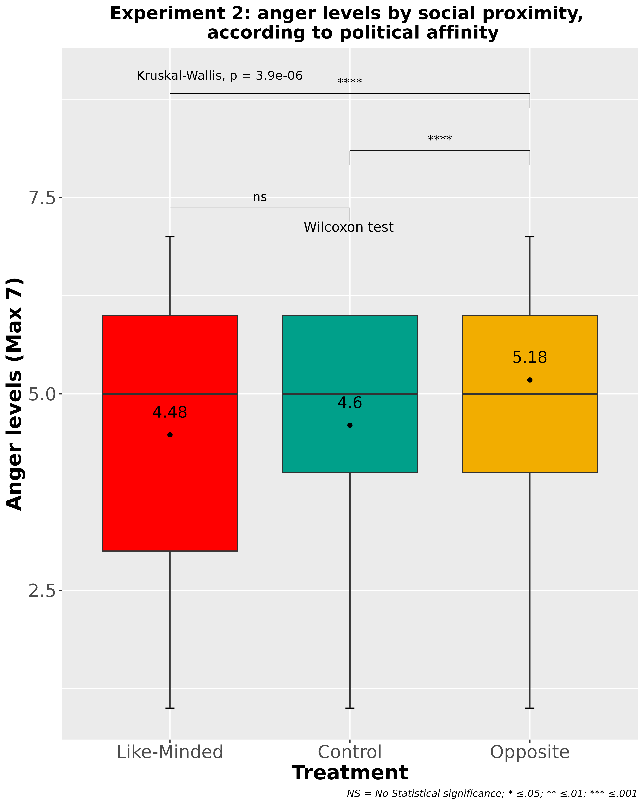

class:center, middle, bg_karl

```{r setup, include=FALSE}
options(htmltools.dir.version = FALSE)
```
```{r xaringan-themer, include=FALSE, warning=FALSE, echo=FALSE, message=FALSE}
library(xaringanthemer)
style_mono_accent(
  base_color = "#23395b",
  header_font_google = google_font("Josefin Sans"),
  text_font_google   = google_font("Montserrat", "300", "300i"),
  code_font_google   = google_font("Fira Mono")
)
style_mono_light(base_color = "#23395b")
```
```{r, warning=FALSE, message=FALSE, echo=FALSE}
remotes::install_github('rstudio/chromote')
pacman::p_load(cowplot, ggplot2, tidyverse, dplyr, patchwork, kableExtra, MASS, ggpubr, fastDummies, renderthis)
```
```{css, echo = F}
.bg_karl {
  position: relative;
  z-index: 1;
}
.bg_karl::before {    
      content: "";
      background-image: url('https://ctrinstitute.com/wp-content/uploads/2022/03/two-people-butting-heads-politics-1200x500-c-default.jpg');
      background-size: 1200px;
      position: absolute;
      top: 0px;
      right: 0px;
      bottom: 0px;
      left: 0px;
      opacity: 0.2;
      z-index: -1;
}
```

### Cuando hablamos con el adversario. Una encuesta experimental sobre emociones y tolerancia política en Chile

<br>
<br>

#### Francisco Villarroel (CICS-UDD) | Jaquelin Morillo (CICS-UDD/MEPOP) 
#### Raúl Elgueta Rosas (IDEA-USACH)

<br>

```{r, echo=FALSE, out.width="15%", fig.align='center'}
knitr::include_graphics("https://training-datalab.com/images/lab-logo.png")
```


<font size="-1">Proyecto ANID N.º 171426: “La estructura de la sociabilidad en Chile y sus consecuencias para nuestra convivencia. Análisis longitudinal de redes sociales”, a Cargo del profesor Vicente Espinoza (COES)</font>

---
class: inverse,center, middle

## Contexto

---
class: center, middle 

### Redes Sociales
<br>
### Estallido Social
<br>
### Emociones en la política

---
class: inverse, center, middle

## Evidencia

---
class: left, middle

.pull-left[

## Cámaras de Eco y Ciudadanía digital 


Redes de amistad y recursos hechas entre personas de pensamiento político similar. 

Incluye homofilia política, identidad social y sesgos de confirmación (Boutyline et.al, 2017; Wollebæk et. al, 2019).
]

.pull-right[

<div style="text-align: justify">

- Concepto multidimensional y complejo en conexión con una relación interrelacionada pero no lineal con la vida cívica offline (Choi, M, 2016)

- 4 elementos principales que construyen la ciudadanía digital: Ética, alfabetización mediática e informática, participación y compromiso y resistencia crítica.

- Tipos de participación política en plataformas digitales:  habilidades tecnológicas, valoración de la acción colectiva en medios digitales y participación en ella. (Choi et.al, 2018; Chadwick, 2013; Castells, 2009). 
<div/>
]

---
class: left, middle


## Relación con intolerancia política y emociones

<div style="text-align: justify">

***La ira:*** 
- Afecta negativamente al tiempo dedicado a la adquisición de información y limita las fuentes consultadas. 
- Opiniones menos reflexivas e inhibe el recuerdo preciso de la información recopilada
- Acciones arriesgadas y confrontación lo que se relaciona de forma directa con la intolerancia y la reticencia la deliberación (Brader & Marcus, 2013:179).

***La felicidad:***
- Está asociada al éxito partidista, a las personas afines y a las políticas deseables. 
- Aumenta el interés por los procesos políticos, motiva la acción y refuerza la confianza en las convicciones previas para tomar decisiones políticas.
- Funciona como un acelerador de la movilización en el contexto político (Brader y Marcus, 2013:176).
<div/>


---
class: inverse,center, middle

## Teoría

---
class: left, middle

.pull-left[

## Teoría del Razonamiento Motivado

***Modelo dual que distingue entre dos estrategias de  procesamiento de la información: la automatizada y la controlada***

]

<div style="text-align: justify">
.pull-right[

- Ambas estrategias interactúan en la producción del pensamiento y la conducta.

- Los sentimientos positivos y/o negativos son parte integral del procesamiento de la información proporcionando motivación y dirección al pensamiento (Taber y Lodge, 2016: 63-64).

- A diferencia de la Teoría de la inteligencia emocional donde el aprendizaje tiene un rol clave en la conformación de opiniones, la Teoría del Razonamiento Motivado sugiere que las emociones sesgan el acceso y valoración de la información por parte de los sujetos involucrados.
<div/>

]

---
class: inverse,center, middle

## Interrogantes

---
class: inverse,center, middle 

### ¿Cuáles son las emociones que moderan los lazos sociales en el contexto de las redes sociales?
### ¿Cómo la afinidad ideológica modera la ira en contextos de cercanía social? 

---
class: inverse,center, middle

## Hipótesis

---
<br>

### Se espera que,

<div style="text-align: justify">
H1: Aquellos individuos con mayor ***intensidad emocional*** serán mas propensos a dejar de seguir en redes sociales a sujetos con ***opinión divergente*** que los individuos con menor intensidad emocional.

<br>

H2: La emociones que manifiestan ***mayor intensidad*** al moderar los lazos sociales en contexto de redes sociales son la ***ira*** y la ***tristeza***.

<br>

H3: Los sujetos expuestos a ***vecinos de pensamiento opuesto*** autorreportarán ***mayores niveles de ira***.  

<br>

H4: Los sujetos expuestos a ***vecinos de pensamiento similar*** autorreportán ***menores niveles de ira***.
<div/>
---
class: left, middle

### Métodos

--
**Muestra**

<div style="text-align: justify">

Encuesta experimental en línea (n= 690) hecha en el Pool del Centre for Experimental Social Sciences (CESS-USACH)
<div/>

--

<div style="text-align: justify">

**Aleatorización**

Aleatorización en bloque en base a membresía a Cámaras de eco y niveles de ciudadanía digital (ambas binarias)

<div/>
--
<div style="text-align: justify">
**Experimental survey**

Caracterización sociodemográfica: Rango etario, género, ingreso, nivel educativo, Ideología política + 2 Estudios experimentales
<div/>
--
<div style="text-align: justify">
**Validación**

Comité de expertos, entrevistas cognitivas, pilotaje

<div/>
--
<div style="text-align: justify">
**Analysis**

ATE, *Kruskall-Walis* and *Wilcoxon test*. Probit y Logit regressions

<div/>

---
class:left, top


### Estudio 1

<br>
<br>

<div style="text-align: justify">

  - El segundo es un experimento con viñetas en el que se evalúa la relación entre Emociones y la fuerza de los vínculos sociales digitales. 

  - Se Aplicará un ATE, test de Kruskall Wallis y Wilcoxon para diferencia entre medias.
  
  - Logit y probit Binomial para variables balanceadas y no balanceadas con sus efectos marginales.
  
  - Los resultados mostraron que quienes presentan una mayor intensidad emocional tienden a romper sus lazos sociales digitales con mayor facilidad.
  
<div/>

---
class: center, middle
background-image: url(mepop_presentation_files/m5.png)
background-size: contain


---
class: center, middle
background-image: url(mepop_presentation_files/m6.png)
background-size: contain


---
background-size: contain
background-position: 50% 50%
class: center, middle

```{r, echo=FALSE, out.width="125%", fig.align='left'}


```
---
background-size: contain
background-position: 50% 50%
class: center, middle

```{r, echo=FALSE, out.width="125%", fig.align='left'}

knitr::include_graphics("mepop_presentation_files/E1_Marginal_effects.png")

```

---
background-size: contain
background-position: 50% 50%
class: center, middle


```{r, echo=FALSE, out.width="100%", fig.align='left'}


```

---
background-size: contain
background-position: 50% 50%
class: left, middle

.pull-left[
```{r, echo=FALSE, out.width="140%", fig.align='left'}


```

]

.pull-right[

**Tested with controls shows:**

- that with more age, more hapiness
- Men increase 3.5 points in hapiness that women
- Fear decreases almost five times less.
- Also right-wing people shows less sadness that center-wing.
]

---
background-size: contain
background-position: 50% 50%
class: center, middle


```{r, echo=FALSE, out.width="100%", fig.align='left'}

knitr::include_graphics("mepop_presentation_files/Experimento3-broke-emotions.png")

```
---
class:left, top

### Results


<br>
<br>

<div style="text-align: justify">

  - Anger and fear are the two main emotions in political discussions

  - Anger indicates risky choices, reduce information process and intolerance

  - People that are more "emotionally intense", tend to unfollow more friends
  
<div/>


---
class:left, top

### Study 2


<br>
<br>

<div style="text-align: justify">

  - Experimento de Lista para observar comportamientos socialmente sensibles.

  - Se medirá el nivel de enojo que provoca la cercanía social (presencial) de una persona de distinto pensamiento político.

  - Tres condiciones experimentales: Control, pensamiento afin y pensamiento opuesto

  - Personas responden nivel de enojo en una escala de 1 a 7 (ordinal).

  - Se Aplicará un ATE, test de Kruskall Wallis y Wilcoxon para diferencia entre medias.
  
  - OLS and Maximum likelihood para variables balanceadas y no balanceadas.

<div/>


---
class: center, middle


```{r, echo=FALSE, fig.align='center'}

```


---
class: center, middle

#### Resultados Estudio 2

.pull-left[

```{r, echo=FALSE, out.width="130%", fig.align='left'}


```
]

<div style="text-align: justify">

.pull-right[


- Ira Aumenta un 13% promedio con una persona de pensamiento político opuesto

]

<div/>

**Personas de poca ciudadanía digital pueden estar más acostumbradas a relacionas sociales presenciales y por eso afecta mas**

---
class: center, middle

#### Resultados Estudio 2


```{r, echo=FALSE, out.width="90%", fig.align='left'}
knitr::include_graphics("mepop_presentation_files/Plot2Homo.png")

```


<div style="text-align: justify">

- Alta membresía a cámaras de eco el porcentaje sube a 14% de ira
- Quienes tienen baja membresía a cámaras de eco sólo sube un 10%

<div/>

---

class: center, middle

#### Resultados Estudio 2


```{r, echo=FALSE, out.width="90%", fig.align='left'}


```


<div style="text-align: justify">

- Baja ciudadanía digital, sube un 21% el nivel de ira con una persona de pensamiento contrario
- Sólo 8% en quienes tienen una alta ciudadanía digital

<div/>

---
class: center, middle


```{r, echo=FALSE, fig.align='center', out.width="88%"}

knitr::include_graphics("mepop_presentation_files/E2Reg_Balanced.png")


```


class:left, top

## Síntesis

```{r, echo=FALSE, fig.align='center'}

knitr:::include_graphics("mepop_presentation_files/discusion.png")

```

---
class:left, top

### Discusión

<br>
<br>
<br>
<br>

- Preponderancia de la ira como emoción conductora de la socialización política

- Cercanía a pensamiento opuesto genera un aumento considerable en emocione snegativas que llevan a conductas políticas intolerantes

- Polarización afectiva es el mejor mecanismo para describir este proceso

- Intensidad emocional: Nivel de emociones puede predecir comportamientos como ruptura de lazos sociales

- Membresía a cámaras de eco aumenta más la intensidad emocional que la ciudadanía digital 

- Infestigaciones futuras: diferencias emocionales opr género, y consideración de oleadas etáreas y comportamiento político


---
class: inversed, center, middle
background-image: url(https://user-images.githubusercontent.com/163582/45438104-ea200600-b67b-11e8-80fa-d9f2a99a03b0.png)
background-size: 50px
background-position: 50% 85%

# ¡Gracias!

####.pull-left[Francisco Villarroel (fvillarroelr@udd.cl)

]

####.pull-right[Jaquelin Morillo (jmorillor@gmail.com)

]

<br>
<br>
<br>
<br>
<br>
<br>
<br>
<br>
<br>
<br>
<br>
<br>
<br>
<br>
<br>
This slide has created with [**xaringan**](https://github.com/yihui/xaringan) and [**XaringanThemer**](https://pkg.garrickadenbuie.com/xaringanthemer/index.html)

---
class: inverted, center, middle

# Appendix

---
class: left, Top

## Eco Chamber membership Scale

- Using a recently validated scale<sup>*</sup> on reinforcement opinions in social media

- There are 7 items with 1 to 10 range each (total Range: 7 to 70)

- Low Eco Chamber Membership: 7 to 39
- High Eco Chamber Membership: 40 to 70

.footnote[[*] Kaakinen, M., Sirola, A., Savolainen, I., & Oksanen, A. (2020). Shared identity and shared
information in social media: Development and validation of the identity bubble
reinforcement scale. Media Psychology, 23(1).]

---
class: left, Top

## Digital Citizenship scale

- Based on a scale developed by Choi<sup>*</sup> (reduced from 34 to 14 items).

- Each item has 7 point scale (1 to 7). Total range: 14 to 98

- Low levels of digital citizenship: 14 to 62
- High levels of Digital citizenship: 63 to 98

.footnote[[*] Choi, M., Glassman, M., & Cristol, D. (2017). What it means to be a citizen in the internet age:
Development of a reliable and valid digital citizenship scale. Computers & Education, 107,
100-112.]

---
class: left, Top


```{r, echo=FALSE, fig.align='center'}

knitr:::include_graphics("mepop_presentation_files/diagrama_encuesta.png")

```

---
class: left, Top

## Experiment 1 

```{r, echo=FALSE, fig.align='center'}

knitr:::include_graphics("mepop_presentation_files/PLotE1EcoHigh.png")

```

---
class: left, Top


```{r, echo=FALSE, fig.align='center'}

knitr:::

```

---
class: left, Top


```{r, echo=FALSE, fig.align='center'}

knitr:::

```

---

class: left, Top


```{r, echo=FALSE, fig.align='center'}

knitr:::

```


